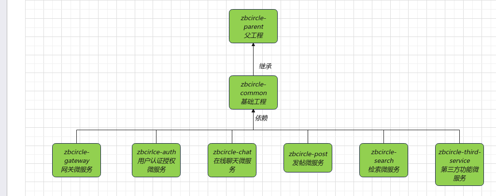
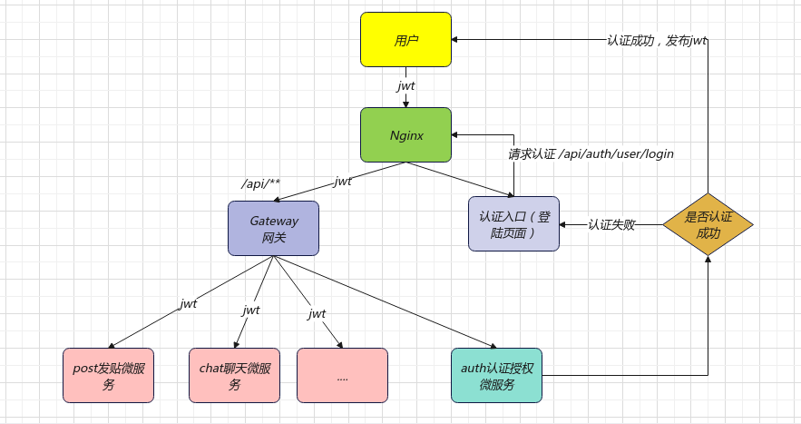

# zbcircle(中北圈)

### 项目简介
***
  本项目是一个属于中北大学的交流圈，用户可以发布帖子，大家可以在一起讨论八卦和新闻，内置一个在线聊天室，
大家可以选择在线用户私聊，也可直接发布在公屏，用户个人聊天部分永久保存聊天记录，并且上架商城功能，同学们可以发布
自己的闲置物品，也可以搜索自己需要的物品购买

### 技术栈
***
- 主语言 Java
- 开发框架 SpringBoot,SpringCloud
- 数据库 MongoDB Mysql
- 中间件 Redis Elasticsearch rabbitMq
- 对象存储：阿里云云存储

### 项目工程关系
***

### 项目流程
***

### 开发日记
***

2023.6.19  完成注册登陆授权功能

2023.6.21 增加网关服务

2023.6.26 增加云存储，编写post模块

2023.7.1 完成在线聊天功能，可以一对一聊天，也可以群体聊天室，使用mongodb持久化保存聊天记录

2023.7.5 完成帖子的全文检索，自动补全 测试目前为止的所有接口功能